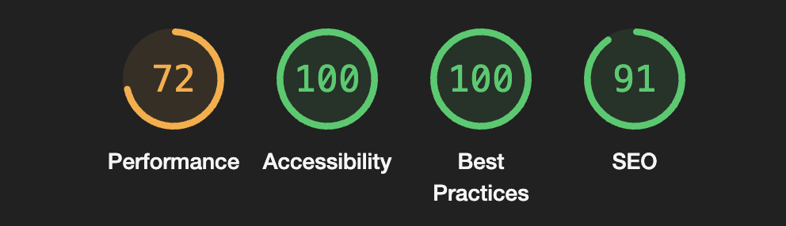

# BRR Media Dashboard

## Overview

This project is a staff dashboard built for BRR Media’s Frontend Developer challenge. It supports common IT and admin workflows, letting staff interact with internal tools to manage tasks, request support, and access team information.

---

## Setup Instructions

1. Clone the repo:

```bash
git clone https://github.com/mace-akkari/BRR-Dashboard.git
cd BRR-Dashboard
```

2. Install dependencies

```bash
npm install
```

3. Start the development server

```bash
npm run dev
```

4. Once the server is running, the app will be available at `http://localhost:3000`(default)  
   You can also view the **live deployed version** here:  
   [https://brr-dashboard-xi.vercel.app](https://brr-dashboard-xi.vercel.app)

---

## Summary of features completed

### Dashboard Page

- Dynamic welcome banner with quotes changing on refresh.
- Simulated notifications and user account
- Quick summary of:
  - Open tickets
  - Tasks pending
  - Latest updates
  - Recent Activity taken from tickets

### Staff Directory Page

- Staff listed as cards or in a table
- Shows: Name, Role, Email, Status (active/inactive)
- **Bonus:** Displayed additional info:
  - Last login
  - Drive storage used
  - Device type

### IT Request Page

- Form includes:
  - Issue Type (dropdown)
  - Description (textarea)
  - File input (simulated upload)
- “Submit Request” button functionality

### Tickets Page

- Displays list of submitted IT tickets
- Shows: Issue Type, Status (Open, In Progress, Resolved), and Created Date

### To-Do List Page

- Add, edit, and delete tasks
- Mark tasks as complete

---

## Assumptions Made

- Authentication and user roles (staff/admin) are mocked or hardcoded for demo purposes
- All data (IT requests, tickets, user/device/workspace info) is mocked and loaded from static files
- Form submissions (e.g. IT requests) do not remain after refresh as no database/local storage is used
- File uploads are simulated
- No notification system is implemented
- With no login feature all users have access to the same interface

---

## Tech Stack

- **Framework:** Next.js
- **Language:** TypeScript
- **Styling:** Tailwind CSS
- **UI Components:** Material UI (MUI)

---

## Screenshot

This an image of a lighthouse review:



---

## What I would add with more time

- Implement authentication and role-based access for staff and admin
- Make the notifications icon and panel update in real time
- Add unit and end-to-end testing using React Testing Library and Cypress
- Expand the To-Do list with additional features, such as draggable tasks and priority indicators
- Test and improve styling across multiple browsers and screen sizes
